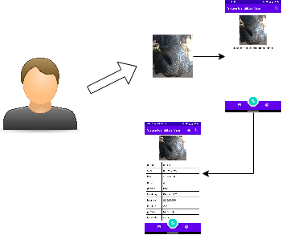
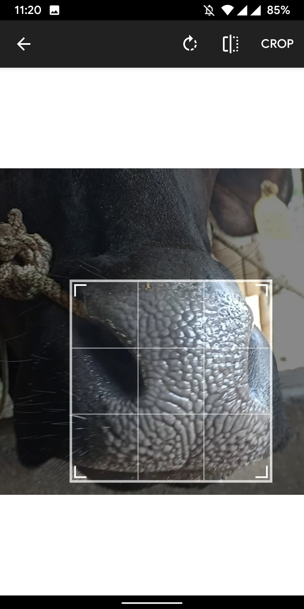
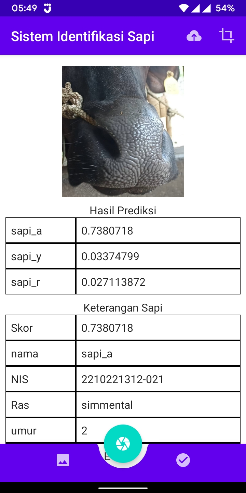
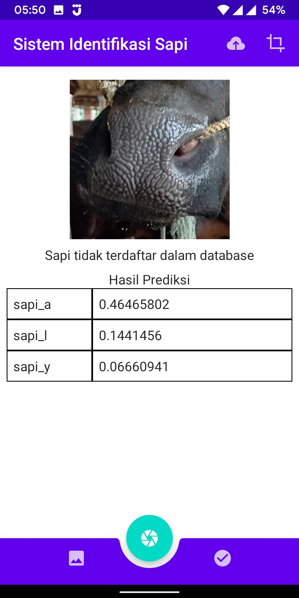

# SISTEM IDENTIFIKASI SAPI (SIS)

## Tentang aplikasi

>aplikasi sistem identifikasi sapi dengan menggunakan gambar moncong sapi. cara kerja aplikasi adalah dengan mengambil gambar
dari mocong sapi dan memasukkan gambarnya ke dalam model machine learning kemudian mendapatkan hasil identifikasi

>model dibuat menggunakan tensorflow lite model maker dengan pretrained model mobilenetv2.

## Ilustrasi cara kerja aplikasi

- Ilustrasi cara kerja aplikasi

## Screenshot aplikasi

- Splash Screen

- Halaman utama

- Halaman pilih gambar

- Hasil pilih gambar

- halaman crop gambar

- halaman hasil prediksi (berhasil)

- halaman hasil prediksi (gagal)

